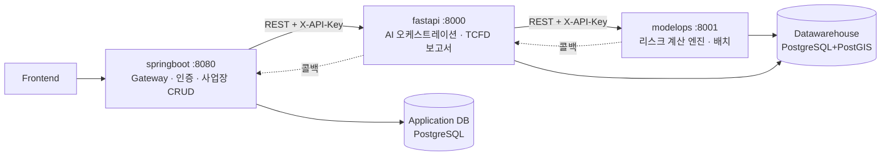

# Polaris Backend — 공통 규약 (CONVENTIONS)

> 3개 레포(`polaris_backend_springboot` · `polaris_backend_fastapi` · `polaris_backend_modelops`)가 공유하는 단일 규약.
> 이 문서는 세 레포에 동일하게 커밋되며, 서비스 간 계약 변경 시 세 레포에서 함께 갱신한다.

## 1. 아키텍처 역할

| 서비스 | 포트 | 책임 | 소유 데이터 |
|---|---|---|---|
| springboot | 8080 | 인증(JWT)·사용자·사업장 CRUD·오케스트레이션·이메일 | users, sites, refresh_tokens, analysis_jobs, reports(메타) |
| fastapi | 8000 | LLM 보고서 생성·RAG·분석 API 집계 | reports(내용 JSONB), 분석 job 상태 |
| modelops | 8001 | H·E·V·P(H)·AAL 계산·연간 배치 | hazard/exposure/vulnerability/probability/aal_* 결과 테이블 |

- 쓰기 주체는 테이블당 하나. 다른 서비스는 읽기만 한다.
- 스키마 변경은 소유 서비스가 주도하고, 이 문서와 각 레포 `docs/`의 dbml을 함께 갱신한다.

## 2. REST API 네이밍

- **경로**: `/api/<복수형 리소스>` — `/api/sites`, `/api/reports`, `/api/analysis`. 단수형 경로(`/api/site`) 금지.
- **리소스 식별자는 path variable**: `/api/sites/{siteId}`, `/api/analysis/{jobId}/status`. 식별자를 query param으로 두지 않는다 (2025-12 계약 불일치 사고의 원인).
- **query param은 필터·옵션 전용**: `?term=short&hazardType=typhoon&scenario=ssp245`.
- **JSON 필드는 camelCase** (FastAPI는 Pydantic alias로 유지).
- **정식 파라미터 명칭** (동의어 금지):

| 개념 | 정식 명칭 | 금지 표기 |
|---|---|---|
| 사업장 ID | `siteId` | site_id |
| 사용자 ID | `userId` | — |
| 분석 작업 ID | `jobId` | jobid, analysisId |
| ModelOps 배치 ID | `batchId` | batchJobId |
| 리포트 ID | `reportId` | — |
| 재해 유형 | `hazardType` (영문 snake_case 값: `extreme_heat` 등 9종) | riskType |
| 기간 | `term` (`short`/`mid`/`long`) | period |
| 시나리오 | `scenario` (`ssp126`/`ssp245`/`ssp370`/`ssp585`) | sspScenario |

- **응답 envelope** (외부·내부 공통):
  - 성공: `{ "result": "success", "message": string, "data": <payload> }`
  - 실패: `{ "result": "error", "code": string, "message": string }`
  - `code`는 UPPER_SNAKE (`SITE_NOT_FOUND`, `MODELOPS_ERROR`). FastAPI 내부 숫자 코드(1xxx~6xxx)는 `code` 뒤에 붙는 상세로만 사용.
- **헬스체크**: 모든 서비스 `GET /api/health` → `{ "status": "ok", "service": "<이름>", "version": "<버전>" }`.

## 3. 서비스 간 통신

- 인증 헤더: `X-API-Key` (env: `INTERNAL_API_KEY`), 세 서비스 동일.
- 장시간 작업: job 발급(`202`) → 상태 폴링 → **완료 콜백**. 콜백 경로는 `/api/internal/callbacks/<이벤트>`로 통일하고 이 문서의 계약 표(별첨 `API_CONTRACT.md`)에 등록한다.
- 계약 변경 절차: ① `API_CONTRACT.md` 갱신 → ② 제공 측 구현 → ③ 소비 측 구현. 문서에 없는 엔드포인트를 호출하는 코드는 금지.

## 4. 환경변수

| 변수 | 의미 | 사용 서비스 |
|---|---|---|
| `DW_DB_HOST/PORT/NAME/USER/PASSWORD` | Datawarehouse (기본 포트 5433) | fastapi, modelops |
| `APP_DB_HOST/PORT/NAME/USER/PASSWORD` | Application DB (기본 포트 5432) | 전체 |
| `SPRINGBOOT_BASE_URL` / `FASTAPI_BASE_URL` / `MODELOPS_BASE_URL` | 서비스 주소 | 상호 호출부 |
| `INTERNAL_API_KEY` | 서비스 간 인증 | 전체 |
| `OPENAI_API_KEY`, `QDRANT_URL` 등 | 서비스 고유 | 해당 서비스 |

- 기본값에 실제 자격증명·내부 주소를 넣지 않는다. 필수값 누락 시 기동 시점에 명확한 에러.
- `.env.example`은 실제 사용 변수와 1:1로 유지한다.

## 5. 폴더 구조

공통: 루트에는 `README.md`, 앱 진입점, 설정 파일만. 부속 문서는 `docs/`, 운영 스크립트는 `scripts/`, 테스트는 `tests/`(Java는 `src/test/java`).

- **Python 레포**: `<패키지>/`(도메인 코드) · `main.py`(진입점) · `tests/` · `scripts/` · `docs/` · `ETL/`
- **Java 레포**: `controller / service / domain(entity·repository) / dto / client / config / security / exception / constants` 레이어 패키지 유지.

## 6. 코드 스타일

- **Python**: black + ruff, line-length 100. 미사용 임포트 금지(F401). 타입힌트는 신규·수정 코드에 필수.
- **Java**: 기존 스타일(탭 들여쓰기·javadoc 헤더) 유지, `.editorconfig`로 명문화. 컨트롤러는 얇게(검증·위임만), 비즈니스 로직은 service, 상태 전이는 entity 메서드.
- 주석·문서·커밋 메시지는 한국어. 커밋은 `[<유형>] <요약>` (`[refactor]`, `[fix]`, `[docs]`, `[chore]`).

## 7. README 공통 목차

각 레포 README는 다음 목차를 따른다: ① 개요(아키텍처에서의 역할) ② 아키텍처 다이어그램 ③ 폴더 구조 ④ 기술 스택 ⑤ 로컬 실행 ⑥ 환경변수 표 ⑦ API 요약(계약 표 링크) ⑧ 배포.
